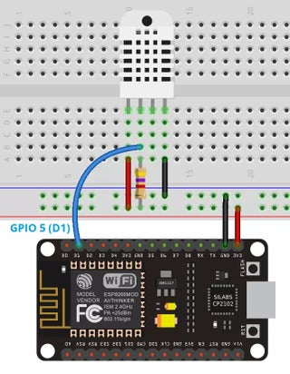

# esp8266TempProject
code for my ESP8266 project.

The device sends a GET Request every 5 min containing JSON to an API, and for the other time it sleeps.
And is used for a preview on a website, this repository only covers the ESP8266 part for uploading to the website.

Replace the given values with your own SSID (home wireless name) + Password = (wireless password).
and the given host is the website it should report to.
Replace the URL with your own api.

```
const char* ssid     = "";
const char* password = "";
const char* host = "myapi.nl/api"; 
String url = "/api/tempInsert/";
```


